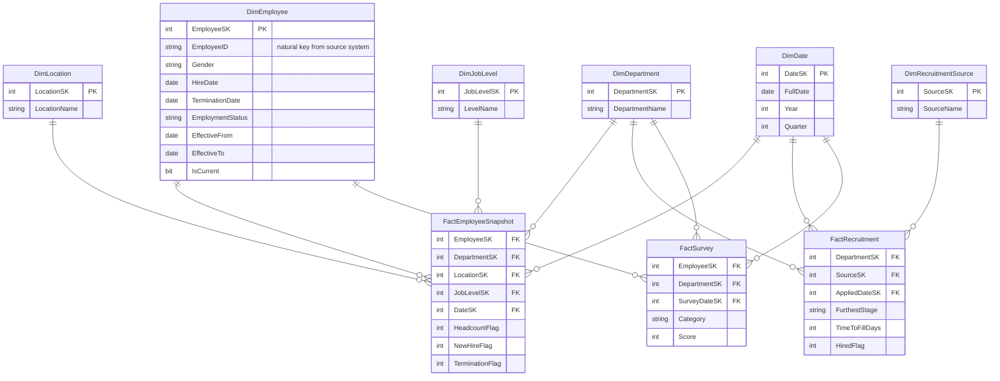

# Solution Architecture
**Enterprise People Analytics Platform**
Prepared by: Rahul Pandey, Data Analyst — People Analytics
Status: Approved for build | July 2026

---

## 1. Purpose

This document defines the technical blueprint for the People Analytics platform before any SQL is written. It covers the database architecture, the Medallion (Bronze/Silver/Gold) layer design, the Gold-layer star schema, naming conventions, the ETL workflow, and the folder/script standards the build will follow.

This document is downstream of the `Project_Charter.md` and `Business_Requirements.md`, and upstream of all SQL development. Any change to grain, keys, or scope during the build should be reflected back into this document first.

---

## 2. Architecture Overview

The platform follows the **Medallion Architecture** pattern: each layer only cleans up or reshapes the layer below it, and nothing skips a layer.

```
Source CSVs (HRIS, ATS, Survey)
        │
        ▼
┌───────────────┐   Raw ingestion, no transformation.
│ Bronze Layer  │   1 table per source file. Adds load metadata only.
└───────────────┘
        │
        ▼
┌───────────────┐   Cleaned, standardized, deduplicated.
│ Silver Layer  │   Business rules applied (see Business_Rules.md).
└───────────────┘   Still source-shaped — not yet dimensional.
        │
        ▼
┌───────────────┐   Star schema. Analytics-ready.
│ Gold Layer    │   Dimension + fact tables, surrogate keys, KPIs.
└───────────────┘
        │
        ▼
   SQL Views  →  Power BI  →  Executive Dashboards
```

**Why three layers instead of loading straight to Gold:** Bronze preserves an untouched copy of source data for auditability and reprocessing. Silver is where data-quality rules and standardization live, isolated from dimensional modeling concerns. Gold is where business logic and KPI definitions live, isolated from data-cleaning concerns. Separating these means a bad source file only requires reprocessing Bronze→Silver, not a full rebuild, and a KPI definition change only touches Gold.

---

## 3. Database Architecture

| Item | Value |
|---|---|
| Database | `PeopleAnalyticsDW` |
| Schemas | `bronze`, `silver`, `gold` |
| Engine | SQL Server / SSMS |
| Load pattern | Full refresh per run (see §7 — acceptable at this data volume; incremental load is a noted future enhancement) |

Each schema is a hard boundary — Silver objects only ever read from `bronze.*`, Gold objects only ever read from `silver.*`. No layer is allowed to read two layers down; this keeps lineage traceable.

---

## 4. Naming Conventions

| Convention | Meaning | Example |
|---|---|---|
| `Dim` prefix | Dimension table (Gold layer) | `DimEmployee` |
| `Fact` prefix | Fact table (Gold layer) | `FactRecruitment` |
| `SK` suffix | Surrogate key — system-generated, used for all joins within the warehouse | `EmployeeSK` |
| `NK` suffix | Natural/business key — the source system's original ID, retained for traceability | `EmployeeID` (NK) |
| `PK` | Primary key of the table | — |
| `FK` | Foreign key referencing a dimension's SK | — |
| `bronze.` / `silver.` / `gold.` prefix | Schema-qualified table name, always used in scripts | `gold.DimEmployee` |
| Snapshot/event dates | Named `<Purpose>DateSK`, always FK to `DimDate` | `SurveyDateSK`, `AppliedDateSK` |

Surrogate keys are used for every join inside the warehouse rather than natural keys, so that source-system ID changes or reused IDs never break a Gold-layer join.

---

## 5. Bronze Layer Design

One Bronze table per source file. No transformation, no type enforcement beyond what's needed to land the data — this layer's only job is a faithful, timestamped copy of the source.

| Bronze Table | Source File | Notes |
|---|---|---|
| `bronze.hris_employees` | `hris_employees.csv` | 1:1 column mapping |
| `bronze.ats_requisitions` | `ats_requisitions.csv` | 1:1 column mapping |
| `bronze.ats_candidates` | `ats_candidates.csv` | 1:1 column mapping |
| `bronze.survey_engagement` | `survey_engagement.csv` | 1:1 column mapping |

Every Bronze table adds two load-metadata columns not present in the source:
- `dw_load_date` (datetime, load timestamp)
- `dw_source_file` (varchar, originating filename, for audit trail)

---

## 6. Silver Layer Design

Silver applies the Data Quality and Business Rules defined in `Business_Rules.md`: deduplication, standardized department/location naming, validated date logic (e.g., termination date cannot precede hire date), and consistent null-handling — but data remains source-shaped (not yet dimensional).

| Silver Table | Cleans / Standardizes |
|---|---|
| `silver.hris_employees` | Department/location name standardization, hire/term date validation, employment status derivation |
| `silver.ats_requisitions` | Status standardization (Open/Filled), null hiring-manager handling |
| `silver.ats_candidates` | Funnel stage standardization, rejection reason grouping, duplicate application removal |
| `silver.survey_engagement` | Score range validation (1–5 for category scores, 0–10 for eNPS), duplicate response removal |

---

## 7. Gold Layer — Star Schema

Gold is the analytics-ready layer: dimension tables with surrogate keys, and fact tables at an explicit, documented grain. This is the schema the Power BI model and all SQL views will be built against.

### 7.1 Dimensions

| Dimension | Grain | Key Attributes |
|---|---|---|
| `DimEmployee` | One row per employee (SCD Type 2 — tracks department/manager changes over time) | EmployeeSK (PK), EmployeeID (NK), Gender, HireDate, TerminationDate, EmploymentStatus, EffectiveFrom, EffectiveTo, IsCurrent |
| `DimDepartment` | One row per department | DepartmentSK (PK), DepartmentName |
| `DimLocation` | One row per office/location | LocationSK (PK), LocationName |
| `DimJobLevel` | One row per job level | JobLevelSK (PK), LevelName |
| `DimRecruitmentSource` | One row per sourcing channel | SourceSK (PK), SourceName |
| `DimDate` | One row per calendar date | DateSK (PK), FullDate, Year, Quarter, Month, MonthName |

### 7.2 Facts

| Fact | Grain | Purpose |
|---|---|---|
| `FactEmployeeSnapshot` | One row per employee per month-end snapshot date | Headcount, attrition, and tenure analysis at any point in time — a **periodic snapshot fact**, not a transaction fact, because point-in-time headcount cannot be derived from hire/term events alone |
| `FactRecruitment` | One row per candidate application | Funnel conversion, time-to-fill, source effectiveness |
| `FactSurvey` | One row per employee per survey category per quarter | Engagement trend, eNPS, and the lagged correlation against `FactEmployeeSnapshot` attrition |

### 7.3 Entity Relationship Diagram


*(Renders natively on GitHub — no external image needed.)*

### 7.4 Key Design Decisions

- **`FactEmployeeSnapshot` is a periodic snapshot fact.** A transaction-only table (hire/term events) cannot answer "what did headcount look like as of March 2024" — that requires a row per employee per period. This is the deliberate tradeoff: more storage, in exchange for point-in-time correctness.
- **`DimDate` is shared across all three facts.** This is what makes the engagement-precedes-attrition analysis possible — both `FactSurvey` and `FactEmployeeSnapshot` join to the same conformed date dimension, so a lagged join (survey quarter vs. exit date) is a straightforward date-key comparison rather than a fragile string/date match.
- **`DimEmployee` is SCD Type 2.** Department and manager assignment can change over time; without history-tracking, a department reorganization would silently rewrite historical headcount attribution.

---

## 8. ETL Workflow

| Step | Layer Transition | Logic |
|---|---|---|
| Extract | Source CSV → Bronze | Raw load, append load metadata, no transformation |
| Clean | Bronze → Silver | Apply Business Rules: dedupe, standardize text, validate dates, handle nulls |
| Model | Silver → Gold | Assign surrogate keys, build dimension tables (incl. SCD2 logic for `DimEmployee`), populate fact tables at their documented grain |
| Serve | Gold → SQL Views | Pre-aggregate or reshape Gold tables for specific KPIs (e.g., a view per dashboard page) |
| Visualize | SQL Views → Power BI | Import mode initially; DirectQuery is a noted future enhancement |

**Load strategy:** full refresh per run for this project's scope. Incremental/delta loading is documented as a future enhancement in `Future_Roadmap.md` rather than built now, since the source data does not yet have reliable change-tracking columns (e.g., `modified_date`) to support it correctly.

---

## 9. Folder & Script Standards

Matches the repository structure defined in the project README.

```
SQL/
├── Database/        01_CreateDatabase.sql
├── Bronze/          03_CreateBronzeTables.sql, 04_LoadBronze.sql
├── Silver/          05_CreateSilverTables.sql, 06_LoadSilver.sql
├── Gold/            07_CreateGoldTables.sql, 08_LoadGold.sql
├── Views/           09_SQLViews.sql
└── Validation/       10_Validation.sql
```

Scripts are numbered and run strictly in order — each script assumes every prior-numbered script has already succeeded. Each script begins with a header comment stating: purpose, layer, source table(s), and target table(s).

---

## 10. Next Steps

1. Implement `01_CreateDatabase.sql` and `02_CreateSchemas.sql`
2. Build Bronze DDL + load scripts (`03`–`04`)
3. Build Silver DDL + transformation scripts (`05`–`06`), applying `Business_Rules.md`
4. Build Gold DDL + load scripts (`07`–`08`), implementing the star schema in §7
5. Build SQL views (`09`) mapped to each Power BI dashboard page
6. Build validation script (`10`) to confirm row counts, key integrity, and KPI reconciliation against Silver
